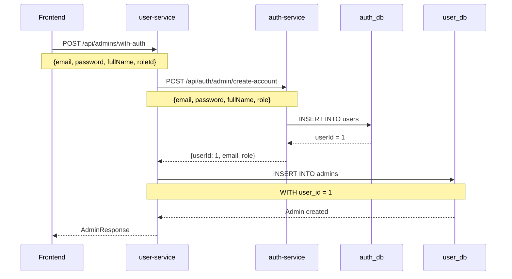
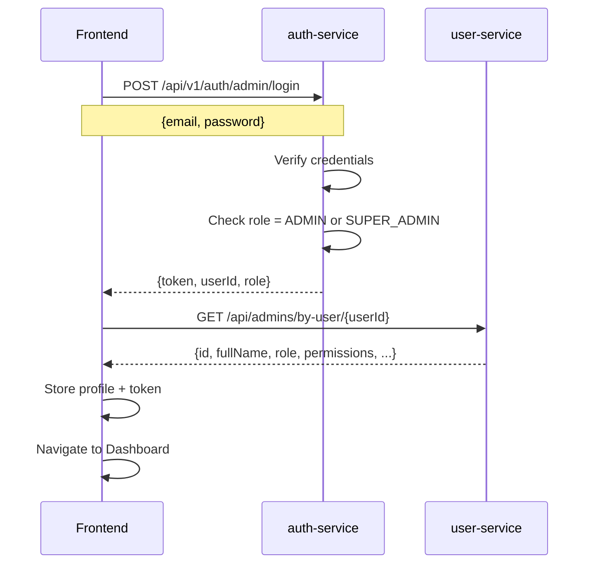

# 🔐 Système d'Administration - Guide Complet

## 📋 Vue d'ensemble

Le système d'administration permet de gérer les comptes administrateurs avec deux niveaux de privilèges:
- **SUPER_ADMIN**: Peut créer/modifier/supprimer d'autres admins
- **ADMIN**: Accès limité selon les permissions assignées

## 🏗️ Architecture

```
┌─────────────────┐         ┌──────────────────┐
│  Frontend       │         │  auth-service    │
│  Angular Admin  │────────▶│  Port: 8081      │
│  Panel          │  Login  │  DB: auth_db     │
└─────────────────┘         └──────────────────┘
        │                            │
        │ Create Admin               │ userId
        │                            ▼
        ▼                    ┌──────────────────┐
┌─────────────────┐         │  user-service    │
│ POST /api/      │────────▶│  Port: 8083      │
│ admins/with-auth│         │  DB: user_db     │
└─────────────────┘         └──────────────────┘
```

### Flux de création d'admin

1. **Frontend** envoie: email + password + nom + roleId
2. **user-service** reçoit la requête
3. **user-service** → **auth-service**: Crée le compte utilisateur
4. **auth-service** retourne: userId
5. **user-service**: Crée le profil admin avec ce userId
6. **Frontend** reçoit: Admin complet créé

## 🚀 Démarrage Rapide

### 1. Créer le premier SUPER_ADMIN

**Option A: Via API (Recommandé)**

```bash
# Assurez-vous que les services sont démarrés
curl -X POST http://localhost:8083/api/admins/with-auth \
  -H "Content-Type: application/json" \
  -d '{
    "fullName": "Super Admin",
    "email": "superadmin@speedline.com",
    "password": "SuperAdmin@2024",
    "roleId": 1,
    "status": "ACTIVE"
  }'
```

**Option B: Via SQL**

Voir le fichier `backend/scripts/create-super-admin.sql`

### 2. Se connecter au panel admin

1. Ouvrir: http://localhost:4200/login
2. Email: `superadmin@speedline.com`
3. Password: `SuperAdmin@2024`
4. Le système vérifie que le rôle est ADMIN ou SUPER_ADMIN

### 3. Créer d'autres admins

Une fois connecté en tant que SUPER_ADMIN:

1. Aller dans **Users > Administrateurs**
2. Cliquer sur **+ Ajouter un Admin**
3. Remplir le formulaire:
   - Nom complet
   - Email professionnel
   - **Mot de passe initial** (obligatoire)
   - Rôle (choisir parmi les rôles disponibles)
   - Permissions personnalisées (optionnel)
4. Cliquer sur **Créer**

## 🔑 Rôles et Permissions

### Rôles disponibles (dans user-service)

| Rôle | Trust Level | Description |
|------|-------------|-------------|
| SUPER_ADMIN | 100 | Accès complet, peut tout gérer |
| ADMIN | 80 | Gestion quotidienne |
| MODERATOR | 60 | Modération de contenu |
| SUPPORT | 40 | Support client uniquement |
| VIEWER | 20 | Lecture seule |

### Rôles dans auth-service

| Rôle | Description |
|------|-------------|
| SUPER_ADMIN | Pour les super administrateurs |
| ADMIN | Pour les administrateurs standard |
| CUSTOMER | Pour les clients |
| COURIER | Pour les livreurs |
| PARTNER | Pour les partenaires |

## 📁 Structure des Fichiers

### Backend - Auth Service

```
auth-service/
├── domain/
│   ├── Role.java                    ✅ Contient SUPER_ADMIN
│   └── User.java
├── controller/
│   └── AuthController.java          ✅ Endpoint /admin/create-account
├── service/
│   └── AuthServiceImpl.java         ✅ Méthode createAdminAccount()
└── dto/request/
    └── CreateAdminAccountRequest.java
```

### Backend - User Service

```
user-service/
├── domain/
│   ├── Admin.java
│   └── AdminRole.java
├── controller/
│   └── AdminController.java         ✅ Endpoint /with-auth
├── service/
│   └── AdminService.java            ✅ Méthode createAdminWithAuth()
├── client/
│   └── AuthServiceClient.java       ✅ Communication avec auth-service
└── dto/
    └── CreateAdminWithAuthRequest.java
```

### Frontend

```
admin-panel/
├── features/users/admins/
│   ├── admin-form/
│   │   ├── admin-form.component.ts  ✅ Champ password ajouté
│   │   └── admin-form.component.html ✅ Input password
│   └── admins-list/
└── core/services/
    └── admin.service.ts             ✅ Méthode createAdminWithAuth()
```

## 🔄 Flux Détaillé

### Création d'un Admin



### Connexion d'un Admin



## 🧪 Tests

### Test 1: Créer un SUPER_ADMIN

```bash
curl -X POST http://localhost:8083/api/admins/with-auth \
  -H "Content-Type: application/json" \
  -d '{
    "fullName": "Super Admin",
    "email": "superadmin@speedline.com",
    "password": "SuperAdmin@2024",
    "roleId": 1
  }'
```

**Réponse attendue:**
```json
{
  "id": 1,
  "userId": 1,
  "fullName": "Super Admin",
  "email": "superadmin@speedline.com",
  "role": {
    "id": 1,
    "code": "SUPER_ADMIN",
    "label": "Super Administrateur",
    "trustLevel": 100
  },
  "status": "ACTIVE"
}
```

### Test 2: Se connecter

```bash
curl -X POST http://localhost:8081/api/v1/auth/admin/login \
  -H "Content-Type: application/json" \
  -d '{
    "email": "superadmin@speedline.com",
    "password": "SuperAdmin@2024"
  }'
```

**Réponse attendue:**
```json
{
  "accessToken": "eyJhbGciOiJIUzI1NiIsInR5cCI6IkpXVCJ9...",
  "refreshToken": "...",
  "user": {
    "id": 1,
    "email": "superadmin@speedline.com",
    "role": "SUPER_ADMIN"
  }
}
```

### Test 3: Récupérer le profil admin

```bash
curl -X GET http://localhost:8083/api/admins/by-user/1 \
  -H "Authorization: Bearer YOUR_TOKEN"
```

## ⚠️ Points Importants

### 1. Séparation des Bases de Données

- **auth_db.users**: Contient email, password (hashé), role
- **user_db.admins**: Contient userId (référence logique), profil détaillé, permissions

⚠️ **IMPORTANT**: Il n'y a PAS de Foreign Key entre les deux bases car elles sont dans des services différents!

### 2. Correspondance des Rôles

| auth-service (users.role) | user-service (admin_roles.code) |
|---------------------------|----------------------------------|
| SUPER_ADMIN               | SUPER_ADMIN                      |
| ADMIN                     | ADMIN, MODERATOR, SUPPORT, VIEWER|

### 3. Mot de Passe

- ✅ Le mot de passe est OBLIGATOIRE lors de la création
- ✅ Il est hashé automatiquement avec BCrypt dans auth-service
- ✅ Le frontend ne l'envoie qu'une seule fois lors de la création
- ✅ En mode édition, le champ password n'apparaît pas

### 4. Permissions

- Les permissions sont définies par le **rôle** (admin_roles.permissions)
- On peut ajouter des permissions **personnalisées** par admin (admins.custom_permissions)
- L'admin hérite des permissions de son rôle + ses permissions custom

## 🐛 Dépannage

### Problème: "Email already exists"

**Cause**: Un compte existe déjà avec cet email dans auth-service

**Solution**: 
```sql
-- Vérifier dans auth_db
SELECT * FROM users WHERE email = 'admin@speedline.com';

-- Si besoin, supprimer
DELETE FROM users WHERE email = 'admin@speedline.com';
```

### Problème: "Admin non trouvé avec le userId"

**Cause**: Le compte existe dans auth-service mais pas le profil dans user-service

**Solution**:
```sql
-- Vérifier dans user_db
SELECT * FROM admins WHERE user_id = 1;

-- Créer manuellement le profil si nécessaire
INSERT INTO admins (user_id, full_name, email, role_id, status)
VALUES (1, 'Admin Name', 'admin@speedline.com', 1, 'ACTIVE');
```

### Problème: "Access denied. Only administrators can log in"

**Cause**: Le rôle dans auth-service n'est pas ADMIN ou SUPER_ADMIN

**Solution**:
```sql
UPDATE users SET role = 'SUPER_ADMIN' WHERE email = 'admin@speedline.com';
```

## 📝 Checklist de Configuration

- [ ] auth-service démarre sur le port 8081
- [ ] user-service démarre sur le port 8083
- [ ] Les bases de données auth_db et user_db existent
- [ ] Les migrations Flyway sont exécutées (V3 et V4 dans user-service)
- [ ] Le rôle SUPER_ADMIN existe dans admin_roles (roleId = 1)
- [ ] Le Role enum contient SUPER_ADMIN dans auth-service
- [ ] Le premier SUPER_ADMIN est créé
- [ ] Le frontend peut se connecter au backend

## 🎯 Prochaines Étapes

1. ✅ Ajouter le rôle SUPER_ADMIN → **FAIT**
2. ✅ Créer endpoint /with-auth → **FAIT**
3. ✅ Ajouter champ password au formulaire → **FAIT**
4. ⬜ Implémenter "Changer le mot de passe"
5. ⬜ Ajouter validation du mot de passe fort
6. ⬜ Implémenter "Mot de passe oublié" pour admins
7. ⬜ Ajouter 2FA (Two-Factor Authentication)
8. ⬜ Implémenter audit log des actions admin

## 📞 Support

Pour toute question, consultez:
- [ARCHITECTURE_FLOW.md](./ARCHITECTURE_FLOW.md) - Diagrammes détaillés
- [ADMIN_API.md](./ADMIN_API.md) - Documentation API complète
- [QUICK_START.md](./QUICK_START.md) - Guide de démarrage rapide
